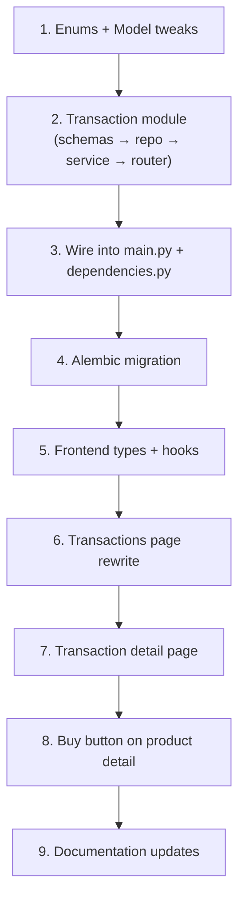

# Transaction Service — Full Feature Implementation

## Background

The Neon Farming project already has:
- **Models**: `Transaction` and `Review` in [transaction.py](file:///Ubuntu/home/kajanan/projects/Neon Farming/backend/models/transaction.py), `Product` in [marketplace.py](file:///Ubuntu/home/kajanan/projects/Neon Farming/backend/models/marketplace.py), and `Account` with `sales/purchases/reviews_given/reviews_received` relationships in [account.py](file:///Ubuntu/home/kajanan/projects/Neon Farming/backend/models/account.py)
- **Marketplace module**: Product CRUD, categories, farmer directory — all working with router/service/repository/schema
- **Frontend**: A stub [transactions/page.tsx](file:///Ubuntu/home/kajanan/projects/Neon Farming/frontend/app/(app)/transactions/page.tsx) using **mock data** (no API integration)
- **Docs**: [18_TRANSACTIONS_AND_REVIEWS.md](file:///Ubuntu/home/kajanan/projects/Neon Farming/doc/18_TRANSACTIONS_AND_REVIEWS.md) describes the intended workflow

**What's missing**: The entire backend `transaction` module (router, service, repository, schemas) and a real API-connected frontend for both **farmer** and **vendor/buyer** sides.

---

## User Review Required

> [!IMPORTANT]
> **Payment Integration**: This plan does **not** include actual payment gateway integration (Stripe, PayHere, etc.). Transactions track the deal record only. If you want payment processing, let me know and I'll extend the plan.

> [!IMPORTANT]
> **Unit Handling**: The `Product` model stores `unit` as a string (kg, tons, units). The transaction `quantity` must be in the same unit as the product. No unit conversion is planned.

> [!IMPORTANT]  
> **Partial Purchase Support**: A vendor/buyer can buy a **portion** of a product listing (e.g., buy 50kg out of 200kg available). The product's `quantity_available` decreases accordingly, and multiple transactions can exist per product. When quantity hits 0, product status auto-flips to `sold_out`.

---

## Open Questions

> [!IMPORTANT]
> **Transaction Status Flow**: The plan uses `pending → confirmed → completed → cancelled` (with `confirmed` as an intermediate step where the seller accepts the deal). Do you want this 4-state flow, or keep the simpler `pending → completed → cancelled` from the current model?

> [!IMPORTANT]
> **Cancellation Rules**: Can either party cancel a `pending` transaction? Or only the buyer? Currently planned: buyer can cancel `pending`, seller can cancel `pending`. Neither can cancel after `confirmed`.

> [!IMPORTANT]
> **Notification Integration**: Should new transactions trigger notifications (e.g., "You received a purchase order for 50kg Tomatoes")? The notification module already exists. Planned: Yes, basic notification on create/status-change.

---

## Proposed Changes

### Component 1: Backend — Transaction Module

New module at `backend/modules/transaction/` following the existing pattern (router → service → repository → schemas).

---

#### [NEW] [schemas.py](file:///Ubuntu/home/kajanan/projects/Neon Farming/backend/modules/transaction/schemas.py)

Pydantic models for transaction and review request/response:

| Schema | Purpose |
|--------|---------|
| `TransactionCreate` | Buyer initiates purchase: `product_id`, `quantity` |
| `TransactionResponse` | Full transaction with product info, seller/buyer names |
| `TransactionListResponse` | Paginated list with summary stats |
| `TransactionStatusUpdate` | Update status (confirm, complete, cancel) with reason |
| `TransactionSummary` | Aggregated stats: total_sales, total_purchases, net_balance |
| `ReviewCreate` | Rating (1-5) + optional comment |
| `ReviewResponse` | Review with reviewer/reviewee info |

Key design: `TransactionCreate` only takes `product_id` + `quantity`. The `seller_id`, `unit_price`, and `total_price` are derived server-side from the product, preventing price manipulation.

---

#### [NEW] [repository.py](file:///Ubuntu/home/kajanan/projects/Neon Farming/backend/modules/transaction/repository.py)

Two repository classes extending `BaseRepository`:

- **`TransactionRepository`**: 
  - `get_by_user(db, user_id, role, status_filter, skip, limit)` — filterable by "as seller" or "as buyer"
  - `get_with_details(db, id)` — eager-loads product, seller, buyer, reviews
  - `get_summary_stats(db, user_id)` — aggregate sales/purchase totals
  - `get_by_product(db, product_id)` — all transactions for a product

- **`ReviewRepository`**:
  - `get_by_transaction(db, transaction_id)` — both reviews for a deal
  - `get_by_user(db, user_id)` — all reviews received by a user
  - `exists_for_reviewer(db, transaction_id, reviewer_id)` — prevent duplicate reviews

---

#### [NEW] [service.py](file:///Ubuntu/home/kajanan/projects/Neon Farming/backend/modules/transaction/service.py)

`TransactionService(BaseService)` with core business logic:

| Method | Logic |
|--------|-------|
| `create_transaction()` | Validates product availability, checks quantity ≤ available, uses `SELECT ... FOR UPDATE` row-level locking to prevent overselling, calculates total_price, decrements `product.quantity_available`, auto-sets `sold_out` if qty reaches 0 |
| `get_my_transactions()` | Returns filtered/paginated transactions for current user (as seller or buyer) |
| `get_transaction_detail()` | Returns single transaction with full product + user details |
| `get_summary()` | Returns aggregate stats (total sales revenue, total purchases, net balance, transaction count) |
| `update_status()` | State machine: `pending → confirmed → completed` or `pending → cancelled`. Validates the right party is making the change. On cancel, restores `product.quantity_available` |
| `create_review()` | Validates: transaction is `completed`, reviewer is buyer or seller, no duplicate review. Creates Review record. Updates `VendorProfile.rating` average |
| `get_reviews()` | Get reviews for a user or transaction |

---

#### [NEW] [router.py](file:///Ubuntu/home/kajanan/projects/Neon Farming/backend/modules/transaction/router.py)

API endpoints under `/transactions`:

| Method | Endpoint | Purpose | Auth |
|--------|----------|---------|------|
| `POST` | `/transactions` | Create a new transaction (buy a product) | Buyer/Vendor |
| `GET` | `/transactions` | List my transactions (filterable: type=sales\|purchases, status) | Bearer |
| `GET` | `/transactions/summary` | Get my aggregate stats | Bearer |
| `GET` | `/transactions/{id}` | Get transaction details | Bearer (seller or buyer only) |
| `PATCH` | `/transactions/{id}/status` | Update status (confirm/complete/cancel) | Bearer |
| `POST` | `/transactions/{id}/reviews` | Leave a review after completion | Bearer |
| `GET` | `/transactions/{id}/reviews` | Get reviews for a transaction | Bearer |
| `GET` | `/reviews/me` | Get all reviews received by current user | Bearer |

---

#### [NEW] [\_\_init\_\_.py](file:///Ubuntu/home/kajanan/projects/Neon Farming/backend/modules/transaction/__init__.py)

Exports the router.

---

### Component 2: Backend — Integration with Existing Code

---

#### [MODIFY] [enums.py](file:///Ubuntu/home/kajanan/projects/Neon Farming/backend/core/enums.py)

Add transaction-specific enums:

```python
class TransactionStatus(str, Enum):
    PENDING   = "pending"
    CONFIRMED = "confirmed"
    COMPLETED = "completed"
    CANCELLED = "cancelled"

TRANSACTION_STATUS_TRANSITIONS = {
    TransactionStatus.PENDING:   [TransactionStatus.CONFIRMED, TransactionStatus.CANCELLED],
    TransactionStatus.CONFIRMED: [TransactionStatus.COMPLETED, TransactionStatus.CANCELLED],
    TransactionStatus.COMPLETED: [],
    TransactionStatus.CANCELLED: [],
}
```

---

#### [MODIFY] [dependencies.py](file:///Ubuntu/home/kajanan/projects/Neon Farming/backend/dependencies.py)

Add `get_transaction_service()` factory function following the existing pattern.

---

#### [MODIFY] [main.py](file:///Ubuntu/home/kajanan/projects/Neon Farming/backend/main.py)

Register the transaction router: `app.include_router(transaction_router, prefix="/api/v1")`

---

#### [MODIFY] [transaction.py](file:///Ubuntu/home/kajanan/projects/Neon Farming/backend/models/transaction.py)

Minor enhancements:
- Add `notes` field (optional text for delivery notes)
- Add `unit` field (copied from product at transaction time for historical accuracy)
- Change `rating` type from `Numeric(2,1)` to `Integer` (1-5 stars, matching doc spec)

---

### Component 3: Database Migration

---

#### [NEW] Alembic migration

New migration to:
- Add `notes` (Text, nullable) and `unit` (String(50)) columns to `transactions` table
- Fix `reviews.rating` column type from `Numeric(2,1)` to `Integer`

---

### Component 4: Frontend — Transaction Hooks & API

---

#### [NEW] [useTransactions.ts](file:///Ubuntu/home/kajanan/projects/Neon Farming/frontend/lib/hooks/useTransactions.ts)

React Query hooks:
- `useMyTransactions(filters)` — fetch paginated transactions with sale/purchase filter
- `useTransactionDetail(id)` — fetch single transaction
- `useTransactionSummary()` — fetch aggregate stats
- `useCreateTransaction()` — mutation: buy a product
- `useUpdateTransactionStatus()` — mutation: confirm/complete/cancel
- `useCreateReview()` — mutation: post a review
- `useMyReviews()` — fetch reviews received

---

#### [NEW] [useTransactions.ts types in types.ts](file:///Ubuntu/home/kajanan/projects/Neon Farming/frontend/lib/types.ts)

Add TypeScript interfaces: `Transaction`, `TransactionSummary`, `Review`, `TransactionFilters`.

---

### Component 5: Frontend — Transaction Pages (role-aware)

Both farmer and vendor/buyer see the **same page** at `/transactions`, but filtered by their user ID. The page detects the user's role from `authStore` and shows the appropriate perspective.

---

#### [MODIFY] [transactions/page.tsx](file:///Ubuntu/home/kajanan/projects/Neon Farming/frontend/app/(app)/transactions/page.tsx)

**Complete rewrite** — replace mock data with real API integration:

**Layout:**
```
┌─────────────────────────────────────────────────────────┐
│ 📊 Transaction History                    [Marketplace] │
├─────────────────────────────────────────────────────────┤
│  ┌───────────┐  ┌───────────┐  ┌───────────┐          │
│  │ 💰 Sales  │  │ 🛒 Buys   │  │ 📈 Net    │          │
│  │ LKR 125K  │  │ LKR 45K   │  │ LKR 80K   │          │
│  └───────────┘  └───────────┘  └───────────┘          │
├─────────────────────────────────────────────────────────┤
│  📊 Financial Overview (Bar Chart: Sales vs Purchases)  │
├─────────────────────────────────────────────────────────┤
│  [All] [Sales] [Purchases]  [Status ▼]  [Search 🔍]   │
│  ┌──────────────────────────────────────────────────┐   │
│  │ 🍅 Tomatoes · 50kg · Buyer: FreshMart           │   │
│  │ LKR 9,000 · ✅ Completed · Jul 25               │   │
│  │                              [View] [⭐ Review]  │   │
│  ├──────────────────────────────────────────────────┤   │
│  │ 🧪 NPK Fertilizer · 10 bags · Seller: AgroCo   │   │
│  │ LKR 4,500 · ⏳ Pending · Jul 23                 │   │
│  │                        [View] [✓ Confirm] [✗ Cancel] │
│  └──────────────────────────────────────────────────┘   │
└─────────────────────────────────────────────────────────┘
```

**Features:**
- Summary cards pull from `GET /transactions/summary` 
- Bar chart uses real monthly aggregated data
- Transaction list from `GET /transactions` with filters
- Role-aware action buttons: seller sees "Confirm", buyer sees "Cancel"
- Click to expand → shows full detail + review section
- Review modal for completed transactions

---

#### [NEW] [transactions/[id]/page.tsx](file:///Ubuntu/home/kajanan/projects/Neon Farming/frontend/app/(app)/transactions/%5Bid%5D/page.tsx)

Transaction detail page:
- Full product info with image
- Seller and buyer details
- Quantity, unit price, total
- Status timeline (pending → confirmed → completed)
- Action buttons based on role and current status
- Reviews section (existing reviews + form to add)

---

### Component 6: Frontend — Buy Product Integration

---

#### [MODIFY] [market/products/[id]/page.tsx](file:///Ubuntu/home/kajanan/projects/Neon Farming/frontend/app/(app)/market/products/%5Bid%5D/page.tsx)

Add a **"Buy Now" button** + quantity input modal to the product detail page. This calls `POST /transactions` to create the transaction. Seller sees their own products differently (no buy button, shows "Your Product").

---

### Component 7: Documentation Updates

---

#### [MODIFY] [18_TRANSACTIONS_AND_REVIEWS.md](file:///Ubuntu/home/kajanan/projects/Neon Farming/doc/18_TRANSACTIONS_AND_REVIEWS.md)

Update with:
- Finalized API endpoints table
- Status state machine diagram  
- Row-level locking explanation for concurrent purchases
- Review system details

---

#### [MODIFY] [04_API_CONTRACT.md](file:///Ubuntu/home/kajanan/projects/Neon Farming/doc/04_API_CONTRACT.md)

Add Transaction and Review endpoints to the API contract with request/response examples.

---

#### [MODIFY] [05_BACKEND_SERVICES.md](file:///Ubuntu/home/kajanan/projects/Neon Farming/doc/05_BACKEND_SERVICES.md)

Add "SERVICE 13: Transaction Module" section documenting the transaction service architecture.

---

#### [MODIFY] [03_DATABASE_MODEL.md](file:///Ubuntu/home/kajanan/projects/Neon Farming/doc/03_DATABASE_MODEL.md)

Update the Transaction and Review table schemas with the new `notes` and `unit` fields.

---

## Implementation Order



---

## Verification Plan

### Automated Tests
- Backend: API endpoint tests using `pytest` + `httpx.AsyncClient`
  - Create transaction → verify product quantity decremented
  - Concurrent purchase test → verify no overselling via row-level lock
  - Status transitions → verify state machine enforcement
  - Review creation → verify duplicate prevention

### Manual Verification
- Start the dev server (`uvicorn main:app --reload`)
- Test the full flow via the frontend:
  1. Farmer creates a product listing from marketplace
  2. Vendor/Buyer browses products and clicks "Buy Now" with a quantity
  3. Transaction appears in both parties' transaction history
  4. Seller confirms → completes the transaction
  5. Both parties leave reviews
  6. Summary stats update correctly
