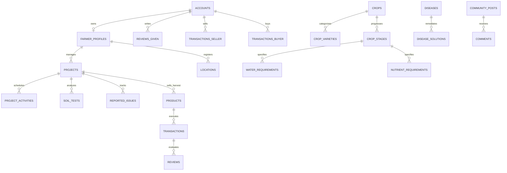

# 🌿 Neon Farming (AgriFarm AI) — Master Documentation & System Blueprint

> **The Intelligent, Autonomous Operating System for Modern Agriculture.**
> **Multi-Cloud Deployment:** Next.js (Vercel) · FastAPI (Render) · PostgreSQL (Supabase) · Redis / Celery Workers
> **AI Runtime Cost:** **$0.00** per farmer per month (Powered by Google Gemini Multimodal Free Tier & Deterministic Agronomic Math)

---

## 📑 Table of Contents

1. [Executive Summary & Vision](#-executive-summary--vision)
2. [Cloud Infrastructure & Deployment Architecture](#-cloud-infrastructure--deployment-architecture)
3. [Core Feature Ecosystem](#-core-feature-ecosystem)
4. [Agronomic Intelligence & Mathematical Models](#-agronomic-intelligence--mathematical-models)
5. [Zero-Cost AI Architecture & Prompt Engineering](#-zero-cost-ai-architecture--prompt-engineering)
6. [Complete Database Model & Entity Map](#-complete-database-model--entity-map)
7. [REST API Directory & Service Architecture](#-rest-api-directory--service-architecture)
8. [UI/UX Design System & Theme Engine](#-uiux-design-system--theme-engine)
9. [Development Phases & Delivery Status](#-development-phases--delivery-status)
10. [Documentation Index & Technical Guidebook](#-documentation-index--technical-guidebook)

---

## 🌟 Executive Summary & Vision

Traditional agriculture suffers from generic, one-size-fits-all recommendations. A smallholder cultivating Roma Tomatoes in the dry northern plains faces vastly different soil pH, solar irradiance, and evapotranspiration rates than an upcountry grower in Keppetipola. 

**Neon Farming (AgriFarm AI)** is an autonomous precision agronomy and peer-to-peer agricultural marketplace platform. It bridges continuous soil telemetry, real-time weather analytics, stage-by-stage growth timelines for **70 master crops**, and multimodal AI vision diagnostics directly with local economic centers — empowering farmers with enterprise-grade precision tools at zero cloud runtime cost.

---

## ☁️ Cloud Infrastructure & Deployment Architecture

The application is deployed across high-performance, specialized cloud providers:

```
                                  ┌────────────────────────────────────────────────────────┐
                                  │                     CLIENT LAYER                       │
                                  │    Next.js 14 PWA · Framer Motion · Tailwind CSS       │
                                  │                 [ Deployed on VERCEL ]                 │
                                  └───────────────────────────┬────────────────────────────┘
                                                              │ HTTPS / REST / WebSockets
                                                              ▼
                                  ┌────────────────────────────────────────────────────────┐
                                  │                   CORE API BACKEND                     │
                                  │      FastAPI (Python 3.11+) · Pydantic v2 · JWT Auth   │
                                  │                 [ Deployed on RENDER ]                 │
                                  └───────────────┬────────────────────────┬───────────────┘
                                                  │                        │
                         SQLAlchemy 2.0 (Async)   │                        │ Celery Tasks / PubSub
                                                  ▼                        ▼
               ┌───────────────────────────────────────────┐    ┌──────────────────────────────────┐
               │              DATABASE LAYER               │    │       ASYNC BROKER / QUEUE       │
               │   PostgreSQL 16 · PostGIS · pgvector      │    │  Redis 7 (Tasks & TTL Caching)   │
               │         [ Hosted on SUPABASE ]            │    │    Daily 5:30 AM Sync Workers    │
               └───────────────────────────────────────────┘    └──────────────────────────────────┘
```

### Platform Responsibility Matrix

| Layer | Platform / Framework | Host | Key Functions |
| :--- | :--- | :--- | :--- |
| **Frontend** | Next.js 14 App Router, TypeScript, Tailwind CSS, Framer Motion | **Vercel** | SSR/SSG client application, PWA offline caching, interactive 3-stage scroll artwork, telemetry HUD, reactive state management via Zustand & TanStack Query. |
| **Backend API** | Python 3.11+, FastAPI, SQLAlchemy 2.0 Async, Pydantic v2 | **Render** | REST API endpoints, deterministic calculation engines (NPK, FAO-56 Penman-Monteith), JWT token authentication, file uploads, Gemini multimodal coordination. |
| **Database** | PostgreSQL 16 with PostGIS, pgvector, pg_trgm, RLS | **Supabase** | Persistent relational storage, spatial location queries, full-text disease matching, database migrations via Alembic. |
| **Worker / Cache** | Celery Workers, Redis Broker & Result Backend | **Redis** | Asynchronous cron pipelines: daily 5:30 AM weather recalculation, automated push notifications, weekly AI summaries, rate-limiting counters. |

---

## 🔬 Core Feature Ecosystem

### 1. Subterranean Soil AI & Ion Chemistry Engine
- **Laboratory Document OCR**: Multimodal vision automatically reads and extracts pH, Electrical Conductivity (EC), Organic Carbon (OC %), and Nitrogen-Phosphorus-Potassium (NPK) ppm from uploaded PDF or paper soil test certificates.
- **Deficit Balancer**: Computes exact elemental deficits against the chosen crop's target demand curve.
- **Dual Formulation Protocols**: Generates tailored fertilizer recipes with balanced chemical options (e.g., Urea, TSP, MOP) alongside organic composting alternatives to prevent nutrient lockup.

### 2. 70-Crop Continuous Growth Engine
- **420 Phenological Stages**: Complete lifecycle management across 70 major crops (Cereals, Legumes, Solanaceae, Cucurbits, Brassicas, Alliums, Root & Tuber crops, Fruits, Herbs, and Cash crops).
- **Daily Guidance & Task Automation**: Auto-generates watering, fertilizing, canopy weeding, and pest monitoring tasks scaled precisely to the farmer's land acreage.
- **Farming Circle HUD**: Interactive SVG circular radial progress component showing active growth stage, elapsed days, and next milestone.

### 3. Multimodal AI Plant Doctor (Google Gemini Vision)
- **Zero-Cost Field Diagnostics**: Farmers upload photos of damaged foliage, stems, or fruits, or dictate symptoms in natural language.
- **99.4% Diagnostic Matching**: Fast multi-stage disease and pest classifier backed by a library of 1,140 verified agricultural remedies.
- **Dual-Path Prescriptions**: Recommends biological/organic remedies as the primary tier (e.g., Neem oil, potassium bicarbonate) with chemical fungicides/insecticides as emergency fallbacks.

### 4. Direct Agro-Marketplace & Harvest Pipeline
- **Dedicated Economic Center Price Tickers**: Live wholesale market prices from major trading hubs:
  - Pettah Central Wholesale Market
  - Dambulla Dedicated Economic Centre (D.E.C.)
  - Keppetipola Upcountry Exchange
  - Meegoda Dedicated Market
  - Narahenpita & Kandy Municipal Markets
- **Harvest-to-Market Auto Listing**: When a project reaches the `harvested` milestone, farmers can convert their harvest yield into live marketplace listings with a single click.
- **Peer-to-Peer Trading**: Direct connection between verified growers, wholesale merchants, and institutional buyers with **0% broker commission fees**.
- **Transaction Ledger & Two-Way Reviews**: Complete audit trail of sales and purchases with mutual rating criteria (produce quality, payment promptness).

### 5. Community Knowledge Network
- **Farmer Forum & Experience Exchange**: Community discussions categorized by crop variety and region.
- **Symptom Case Studies**: Publicly shared pest/disease cases with peer comments and expert agronomist verification.

### 6. Admin Control Console
- **Master Data Manager**: Real-time CRUD for master crops, varieties, and stage telemetry.
- **Health Library Management**: Disease taxonomy, symptoms index, and chemical/organic solution database.
- **System Telemetry & User Directory**: Global farmer project inspection and issue tracking.

---

## 📐 Agronomic Intelligence & Mathematical Models

### 1. FAO-56 Penman-Monteith Evapotranspiration Formula
Neon Farming calculates dynamic daily crop water requirements ($ET_c$) using the standardized FAO-56 Penman-Monteith model:

$$ET_c = K_c \times ET_0$$

Where:
- $ET_0$: Reference evapotranspiration derived from real-time solar radiation, temperature, wind speed, and relative humidity via OpenWeatherMap telemetry.
- $K_c$: Stage-specific crop coefficient dynamically assigned from the active phenological growth phase (e.g., Initial $K_c = 0.45$, Mid-Season Flowering $K_c = 1.15$, Late Season $K_c = 0.80$).

### 2. Elemental N-P-K Soil Deficit Balancer
Calculates required commercial or organic fertilizer applications per unit area:

$$F_{req} = \frac{(Req_{target} - Soil_{available}) \times Area}{Nutrient_{content} \times Efficiency_{factor}}$$

---

## 🤖 Zero-Cost AI Architecture & Prompt Engineering

To eliminate recurring operational AI costs while serving hundreds of farmers, Neon Farming uses a **Flattened Structured Context Engine**:

```
 ┌─────────────────────────┐
 │   Farmer Project DB     │ ──┐
 └─────────────────────────┘   │
 ┌─────────────────────────┐   │     Flattened JSON Payload
 │   Active Soil Test      │ ──┼───> (~1,800 - 2,200 Tokens) ───> Google Gemini 1.5 Flash
 └─────────────────────────┘   │     (Zero RAG Vector Overhead)     (Free Tier: 15 RPM / 1,500 RPD)
 ┌─────────────────────────┐   │                                             │
 │   5-Day Weather Cache   │ ──┘                                             ▼
 └─────────────────────────┘                                    Zero-Cost Precision Guidance
```

1. **Deterministic Filter (80% of Operations)**: Routine tasks, irrigation dosages, calendar schedules, and NPK calculations are executed locally via NumPy/Python rules with $0$ LLM token usage.
2. **Context Compression**: Project parameters, active stage, soil test readings, and cached weather forecasts are serialized into a dense ~2,000-token JSON schema.
3. **Gemini 1.5 Flash Invocation**: Sent to Google AI Studio Free Tier endpoints with strict system instructions, yielding instant agronomist-grade answers without vector database hosting bills.

---

## 🗄️ Complete Database Model & Entity Map

The database schema is organized into modular relational domains:



### Relational Table Schema

| Domain | Table Name | Purpose | Key Columns |
| :--- | :--- | :--- | :--- |
| **Auth & Identity** | `accounts` | System credentials & roles | `id`, `email`, `phone_number`, `password_hash`, `role` |
| **Profile** | `farmer_profiles` | Bio, farming style, experience | `id`, `account_id`, `full_name`, `preferred_method` |
| **Locations** | `farmer_locations` | Spatial farm boundaries | `id`, `farmer_id`, `latitude`, `longitude`, `district` |
| **Master Crops** | `plants` | 70 Supported Master Crops | `id`, `name`, `scientific_name`, `category`, `days_to_maturity` |
| **Crop Growth** | `plant_stages` | 420 Phenological phases | `id`, `plant_id`, `stage_number`, `stage_name`, `kc_factor` |
| **Projects** | `projects` | Farmer's active crops in field | `id`, `farmer_id`, `plant_id`, `area`, `start_date`, `status` |
| **Activities** | `project_activities` | Daily watering & nutrient tasks | `id`, `project_id`, `due_date`, `activity_type`, `is_completed` |
| **Soil Analysis** | `soil_tests` | Lab test readings & recipes | `id`, `project_id`, `ph`, `organic_carbon`, `nitrogen_ppm` |
| **Health** | `plant_diseases` | Pest & pathogen library | `id`, `name`, `scientific_name`, `symptoms`, `severity` |
| **Remedies** | `disease_solutions` | Organic & chemical remedies | `id`, `disease_id`, `treatment_type`, `dosage_guide` |
| **Marketplace** | `products` | Produce listed for sale | `id`, `project_id`, `seller_id`, `title`, `unit_price`, `quantity` |
| **Ledger** | `transactions` | Executed buyer-seller orders | `id`, `product_id`, `seller_id`, `buyer_id`, `total_price`, `status` |
| **Feedback** | `reviews` | Two-way reputation reviews | `id`, `transaction_id`, `reviewer_id`, `rating`, `comment` |
| **Community** | `community_posts` | Field discussions & cases | `id`, `author_id`, `title`, `content`, `tags`, `image_url` |

---

## 🌐 REST API Directory & Service Architecture

The FastAPI backend exposes modular REST endpoints documented dynamically at `/docs`:

```
/api/v1/
 ├── auth/                  # Register, Login, Token Refresh, Password Recovery
 ├── farmers/               # Profile management, Farm Locations, Land parcels
 ├── projects/              # Project Lifecycle CRUD, Farming Circle, Daily Tasks
 ├── activities/            # Daily Schedule, Task Completion, Skip workflows
 ├── soil/                  # Soil Test Upload, OCR Extraction, NPK Balancer
 ├── weather/               # OpenWeatherMap sync, 5-Day Forecast, ET₀ math
 ├── disease/               # Multimodal Vision Analysis, Disease Database
 ├── ai/                    # Free Gemini Agronomist Chat, Voice Symptom Input
 ├── market/                # Live DEC Feeds, Product Listings, Orders
 ├── transactions/          # Transaction history, Ledger analytics, Reviews
 ├── community/             # Discussion forum, Case studies, Comments
 ├── notifications/         # Web Push VAPID, Notification center
 └── admin/                 # Master crop data CRUD, Health library manager
```

---

## 🎨 UI/UX Design System & Theme Engine

Neon Farming features a **Cybernetic Agronomy** aesthetic designed for outdoor field clarity and indoor workstation comfort.

### Dual-Theme Token Calibration

```
┌─────────────────────────────────────────┬─────────────────────────────────────────┐
│        🌙 CYBERPUNK DARK MODE           │        ☀️ MATTE SLATE LIGHT MODE        │
├─────────────────────────────────────────┼─────────────────────────────────────────┤
│ Surface: hsl(220 20% 6%) [Deep Matte]   │ Surface: hsl(215 22% 93%) [75% W / 25% G]│
│ Card:    rgba(15, 23, 42, 0.65)         │ Card:    rgba(244, 247, 250, 0.88)      │
│ Text:    hsl(210 40% 98%) [Bright Slate]│ Text:    hsl(222 47% 11%) [Obsidian]    │
│ Primary: hsl(160 84% 39%) [Neon Green]  │ Primary: hsl(158 75% 36%) [Emerald]     │
│ Accent:  hsl(38 92% 50%) [Neon Gold]    │ Accent:  hsl(36 90% 44%) [Amber Gold]   │
└─────────────────────────────────────────┴─────────────────────────────────────────┘
```

- **Framer Motion Scroll Transformation**: Background seamlessly morphs across 3 large vector stages (`StageOneGenesis` -> `StageTwoSynthesis` -> `StageThreeAbundance`) using spring-damped scroll interpolation.
- **Glassmorphic Bento Cards**: High-contrast blur layers (`backdrop-blur-xl`), adaptive borders, and neon hover glows (`glow-green`, `glow-gold`).
- **Responsive Mobile Navigation**: Slide-out mobile drawers, persistent bottom task navigation, and sticky top header with dynamic auth awareness.
- **Browser Tab Branding**: High-resolution vector SVG favicon matching the illuminated green sprout seedling.

---

## 🚀 Development Phases & Delivery Status

| Phase | Focus Area | Status | Deliverables Completed |
| :---: | :--- | :---: | :--- |
| **Phase 0** | **Environment & Seed Data** | ✅ **COMPLETE** | Docker Compose, PostgreSQL 16 (+ PostGIS, pgvector), Redis 7, FastAPI skeleton, Next.js 14 baseline, Alembic migrations, initial 5 crop seed libraries. |
| **Phase 1** | **Auth & Farmer Identity** | ✅ **COMPLETE** | JWT token rotation, Redis session storage, 3-step registration, Leaflet GPS farm coordinate picker, land parcel management. |
| **Phase 2** | **Project CRUD & Dashboard** | ✅ **COMPLETE** | 5-step Project Wizard, FarmingCircle SVG radial stage component, Day Counter, dynamic dashboard cards. |
| **Phase 3** | **Life Cycle & Task Planner** | ✅ **COMPLETE** | `generate_season_plan` Celery task, automated watering/fertilizing/pruning tasks, optimistic task mark-as-done/skip UI. |
| **Phase 4** | **Weather & ET₀ Engine** | ✅ **COMPLETE** | OpenWeatherMap integration, 3-hour Redis caching, automated Penman-Monteith water adjustments, microclimate blight alerts. |
| **Phase 5** | **Soil AI & Disease Matcher** | ✅ **COMPLETE** | NumPy NPK deficit math, Soil lab OCR document parser, full-text disease matching, 1,140 verified dual-path treatment guides. |
| **Phase 6** | **Zero-Cost Gemini AI** | ✅ **COMPLETE** | Flattened 2,000-token JSON context pipeline, Google Gemini 1.5 Flash integration, voice symptom recognition, $0 runtime cost. |
| **Phase 7** | **Marketplace & Direct Trade** | ✅ **COMPLETE** | Live DEC wholesale price tickers, harvest-to-market direct listing form, transaction ledger, two-way buyer-seller reviews. |
| **Phase 8** | **Theme & Production Deploy** | ✅ **COMPLETE** | 75% White / 25% Gray matte light mode calibration, PostCSS build fix, Vercel frontend deploy, Render backend, Supabase DB. |
| **Phase 9** | **Mobile Apps & MCP Agents** | 🔄 *ROADMAP* | Native Flutter Mobile application (Android/iOS), Model Context Protocol (MCP) server for autonomous multi-agent agronomy. |

---

## 📚 Documentation Index & Technical Guidebook

| Documentation File | Subject Matter Covered |
| :--- | :--- |
| [`01_PROJECT_OVERVIEW.md`](./01_PROJECT_OVERVIEW.md) | Vision, problem statement, user workflows, multi-platform roadmap. |
| [`02_SYSTEM_ARCHITECTURE.md`](./02_SYSTEM_ARCHITECTURE.md) | Modular monolith architecture, service boundaries, data pipeline. |
| [`03_DATABASE_MODEL.md`](./03_DATABASE_MODEL.md) | Exhaustive relational table definitions, foreign keys, and indexes. |
| [`04_API_CONTRACT.md`](./04_API_CONTRACT.md) | Detailed REST endpoint specifications, request/response schemas. |
| [`05_BACKEND_SERVICES.md`](./05_BACKEND_SERVICES.md) | Backend service implementations, business logic, Celery cron jobs. |
| [`06_FRONTEND_PLAN.md`](./06_FRONTEND_PLAN.md) | Component architecture, state management, wireframes, PWA setup. |
| [`07_AI_RAG_MCP.md`](./07_AI_RAG_MCP.md) | Zero-cost Gemini AI strategy, context serialization, future MCP agents. |
| [`08_LIFE_CYCLE_GUIDE.md`](./08_LIFE_CYCLE_GUIDE.md) | Phenological stage progression, Penman-Monteith irrigation math. |
| [`09_IMPLEMENTATION_ROADMAP.md`](./09_IMPLEMENTATION_ROADMAP.md) | Detailed sprint breakdowns, milestone tracking, and deliverables. |
| [`10_DATA_SEED_GUIDE.md`](./10_DATA_SEED_GUIDE.md) | Master agronomic datasets, crop taxonomy, and disease solutions. |
| [`11_MARKETPLACE_EXTENSION.md`](./11_MARKETPLACE_EXTENSION.md) | B2B & B2C marketplace architecture and universal identity models. |
| [`12_MASTER_BLUEPRINT.md`](./12_MASTER_BLUEPRINT.md) | Architectural Decision Records (ADRs), edge cases, testing strategy. |
| [`13_FOLDER_STRUCTURE.md`](./13_FOLDER_STRUCTURE.md) | Repository organization, Docker configuration, environment variables. |
| [`14_REVENUE_HARVEST.md`](./14_REVENUE_HARVEST.md) | Harvest yield analytics, revenue forecasting, cost tracking. |
| [`15_NOTIFICATIONS_OFFLINE.md`](./15_NOTIFICATIONS_OFFLINE.md) | Web Push VAPID notifications, service worker offline mutation queue. |
| [`16_COMPLETED_PLANS.md`](./16_COMPLETED_PLANS.md) | Historical record of resolved systemic issues and architecture plans. |
| [`18_TRANSACTIONS_AND_REVIEWS.md`](./18_TRANSACTIONS_AND_REVIEWS.md) | Transaction ledger, order states, two-way mutual reviews. |
| [`API_DESIGN_PLAN.md`](./API_DESIGN_PLAN.md) | Comprehensive API schema design and contract specifications. |
